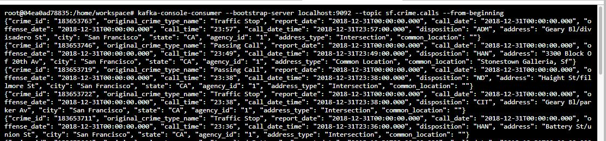
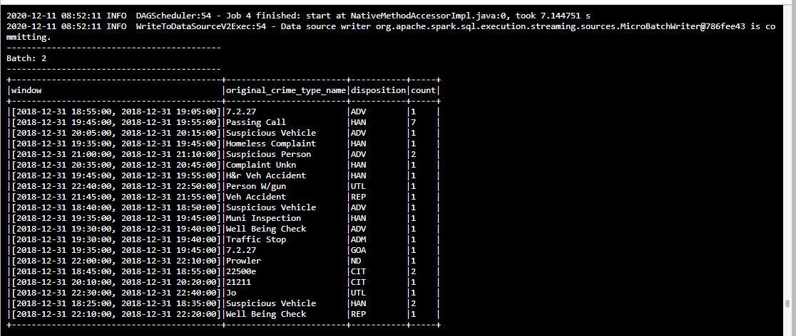
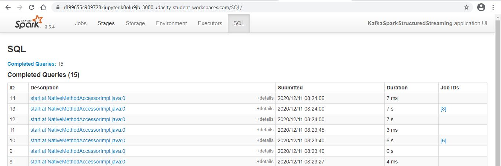

# SF Crime Statistics with Spark Streaming

## Project Overview
In this project, you will be provided with a real-world dataset, extracted from Kaggle, on San Francisco crime incidents, and you will provide statistical analyses of the data using Apache Spark Structured Streaming. You will draw on the skills and knowledge you've learned in this course to create a Kafka server to produce data, and ingest data through Spark Structured Streaming.

## Setup & Running
This project requires creating topic (sf.crime.calls), starting Zookeeper and Kafka servers, and your Kafka bootstrap server (port 9092. Modify the zookeeper.properties and server.properties appropriately if need to use different port. Change topic name inside file kafka_server.py if required.

To start Zookeeper and Kafka server, use the following command:

    /usr/bin/zookeeper-server-start config/zookeeper.properties

    /usr/bin/kafka-server-start config/server.properties
    
    
Run the following command to start sending data to kafka topic:

    python kafka_server.py
    
    
Use the kafka-console-consumer command to view messages sent to the kafka topic:

    kafka-console-consumer --topic sf.crime.calls --bootstrap-server localhost:9092 --from-beginning
    

**Sample kafka-console-consumer output**
    
Run command below to launch streaming application:

    spark-submit --packages org.apache.spark:spark-sql-kafka-0-10_2.11:2.3.4 --master local[*] data_stream.py

**Progress reporter output after executing Spark job**

Here is the screenshot of the Spark Streaming UI as the streaming continues.

---    
## Questions

1. How did changing values on the SparkSession property parameters affect the throughput and latency of the data?

    This have impact on the reported metrics such as `inputRowsPerSecond` and `processedRowsPerSecond` shown in the progress report (i.e jobs completed much faster/slower )

2. What were the 2-3 most efficient SparkSession property key/value pairs? Through testing multiple variations on values, how can you tell these were the most optimal?

    Here is the list of configuration tested:-
    - `"spark.sql.shuffle.partitions": 10`
    - `"spark.streaming.kafka.maxRatePerPartition": 10`

    Both shows an increase on the reported `inputRowsPerSecond` and `processedRowsPerSecond` metrics.

    Beside that, increase kafka partition will also increase spark partitions, which contribute to faster processing.

    
